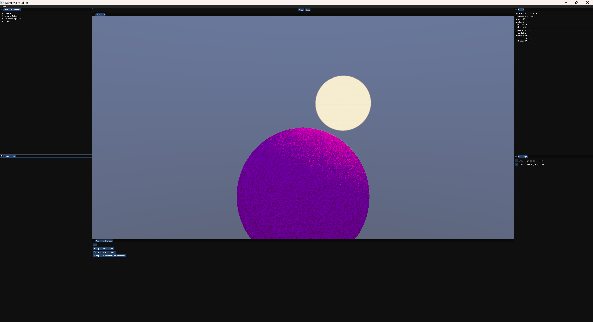

Note: this project requires premake to build properly
to download the latest version of premake
use this link https://github.com/premake/premake-core/tree/master

Note: all assets most be located where the assets folder is and in order to build the project you must use Visual Studio Community 2026 but there are options to run the project in Visual Studio Code if you so choose to use that after building in Visual Studio Community

Note: the Python scripting engine is a work in progress feel free to contribute via pull request and help with working on it

